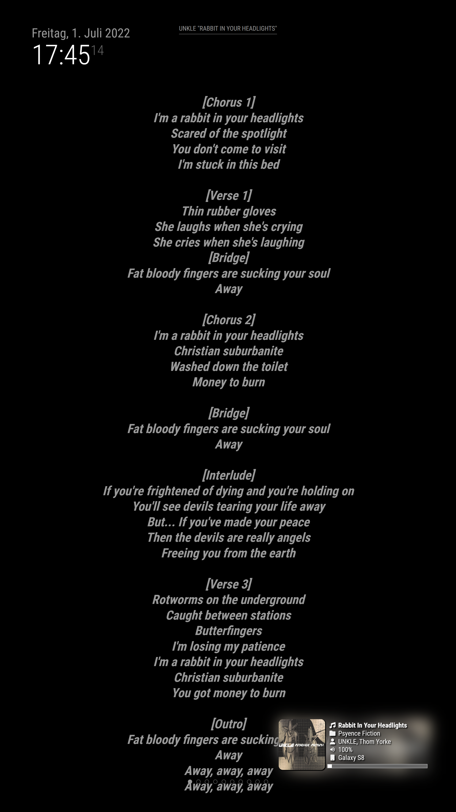

# MMM-FF-Genius-Lyrics

[](https://choosealicense.com/licenses/isc)

A module for [MagicMirror²](https://github.com/MichMich/MagicMirror) that displays lyrics from the [genius api](https://docs.genius.com/) (API key required).

This module complements the [MMM-Spotify module](https://github.com/skuethe/MMM-Spotify) and listens for it's song info notifications to automatically fetch the lyrics for the currently playing song.

## Installation

Just navigate to the `modules` directory of your MagicMirror² installation and clone this repository.

```sh
git clone https://github.com/shin10/MMM-FF-Genius-Lyrics.git
cd MMM-FF-Genius-Lyrics && npm i
```

## Configuration

**Example:**

```js
{
  module: "MMM-FF-Genius-Lyrics",
  position: "fullscreen_below",
  header: "Genius Lyrics",
  classes: "custom-genius-lyrics",
  config: {
    apiKey: "${GENIUS_LYRICS_CLIENT_ACCESS_TOKEN}", // your CLIENT ACCESS TOKEN from https://genius.com/api-clients
    lyricsClasses: ["medium" , "bold", "italic"]
  }
},
```

### Configuration Options

| **Option**      | **Type**   | **Default**          | **Description**                         |
| --------------- | ---------- | -------------------- | --------------------------------------- |
| `apiKey`        | `string`   | `null`               | The client access token of your app.    |
| `lyricsClasses` | `string[]` | `["medium", "thin"]` | A list of classes to format the lyrics. |

#### `apiKey`

To access the genius lyrics database you'll need to create an account at [Genius](https://genius.com). Then go to [https://genius.com/api-clients/new](https://genius.com/api-clients/new) and create a new api client. Fill in a `App Name` and `App website URL` for example `http://localhost:8080`; hit save.
Then click on the link labeled `Generate Access Token` to request the `apiKey` for your config.
